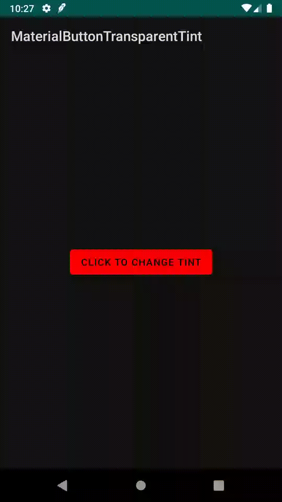
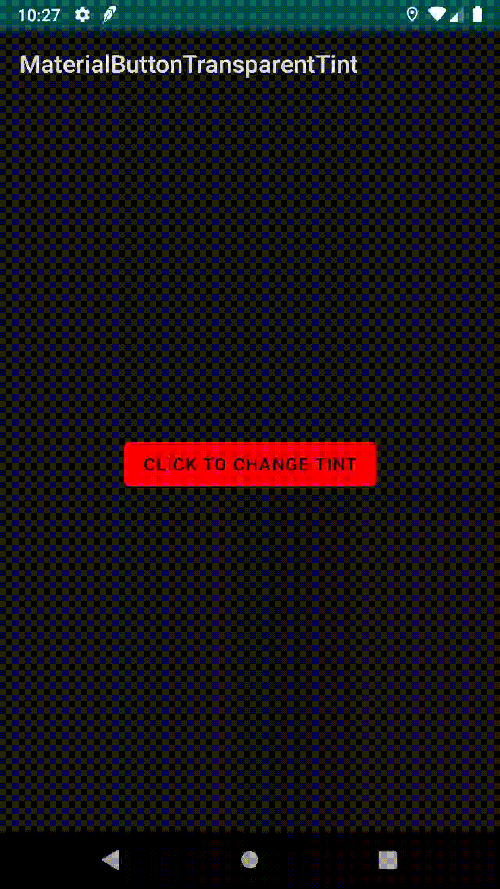
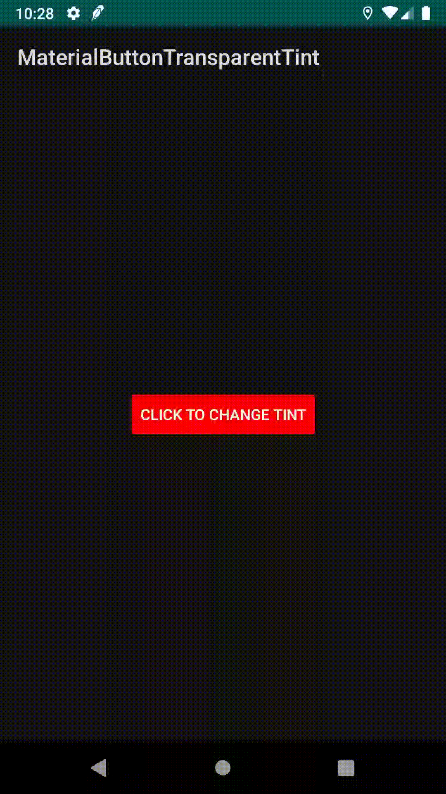

MaterialButton Transparent Background Tint Issue
===

This project demonstrates a bug in `MaterialButton` (a widget in [Material Components for Android](https://github.com/material-components/material-components-android)).

Issue: [material-components/material-components-android#1033](https://github.com/material-components/material-components-android/issues/1033)

## Symptom

Setting a non-opaque background tint (via `setBackgroundTintList`) on a `MaterialButton` causes the new background tint to blend with the previous background tint, rather than replace it. This is especially noticeable when trying to set a transparent background tint, which has no effect.

## Demo

In the following demo ([MainActivity](app/src/main/java/wtf/log/materialbuttontransparenttint/MainActivity.kt), [activity_main.xml](app/src/main/res/layout/activity_main.xml)), we define a `MaterialButton` like so:
```xml
<com.google.android.material.button.MaterialButton
    android:id="@+id/button"
    android:layout_width="wrap_content"
    android:layout_height="wrap_content"
    android:backgroundTint="#F00"
    android:text="Click to change tint"
    app:layout_constraintBottom_toBottomOf="parent"
    app:layout_constraintEnd_toEndOf="parent"
    app:layout_constraintStart_toStartOf="parent"
    app:layout_constraintTop_toTopOf="parent"
    tools:ignore="HardcodedText" />
```

and change the background tint whenever the button is pressed:
```kotlin
class MainActivity : AppCompatActivity() {

    private var color = Color.RED

    override fun onCreate(savedInstanceState: Bundle?) {
        super.onCreate(savedInstanceState)
        setContentView(R.layout.activity_main)

        val button: AppCompatButton = findViewById(R.id.button)
        button.setOnClickListener {
            // does not appear at all
            val altColor = 0x00000000
            // blends with red, result is purple
            // val altColor = 0x660000FF
            val nextColor = if (color == Color.RED) altColor else Color.RED
            button.backgroundTintList = ColorStateList.valueOf(nextColor)
            color = nextColor
        }
    }
}
```

As seen in the demonstration below, clicking the button has no effect:



The issue appears to be that the new color is actually blended with the previous color - an effect that can be confirmed by changing `altColor` to `0x660000FF` (translucent blue). In this demonstration, the new color is purple:




This issue is not present when with either `android.widget.Button` or `androidx.appcompat.widget.AppCompatButton`.

Using an `altColor` of `0x00000000` on an `androidx.appcompat.widget.AppCompatButton`:



Using an `altColor` of `0x660000FF` (translucent blue) on an `androidx.appcompat.widget.AppCompatButton`:


